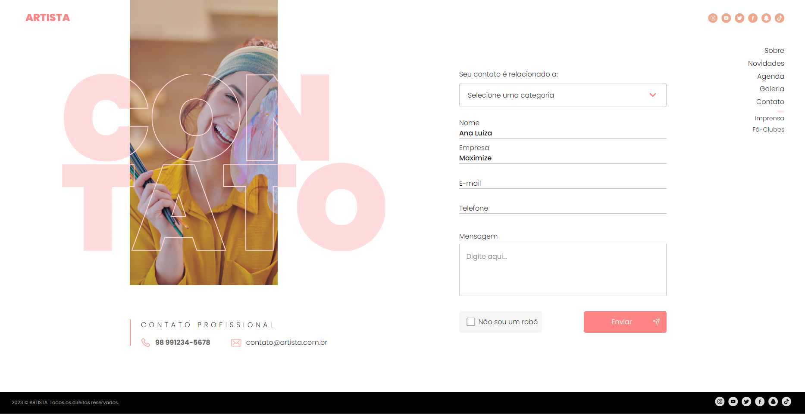

# ThayOG for Maximize

ThayOG is a responsive contact page with form validation.

## Commands to utilize the project with Docker

To use this project with docker, you need to instal Docker and Git

- Version docker: 24.0.7
- You can clone the repo: 'git clone https://github.com/leonardotavares20/ThayOG-Maximize.git'
- After clone the repo, use "cd ./ThayOG-Maximize" in terminal to change the directory for the project,
- Start docker in your pc
- Type in terminal: "docker build -t thayog-maximize ."
- Start the container: "docker run --name thayog-maximize -it -p 8080:80 -d thayog-maximize",
- After acess the project at the port: localhost:8080
- To stop the container: 'docker stop thayog-maximize'
- To restart execution: 'docker start thayog-maximize'

## Dependencies

- Stylus: 0.62.0
- Node: v20.11.1
- NPM: 10.2.4

## Project Access in Development Mode

If you plan to use this project in development mode, you will need to have Node.js and Git installed on your machine.

- Clone the project using "git clone https://github.com/leonardotavares20/ThayOG-Maximize.git" in your terminal (VSCode or your system's terminal).
- Navigate to the project directory using cd ./ThayOG-Maximize
- Install dependencies using "npm install".
- Compile the css using "stylus -w src/styles/app.styl --out public/css"
- Open the index.html file or install the Live Server extension in your VSCode and run the project.
